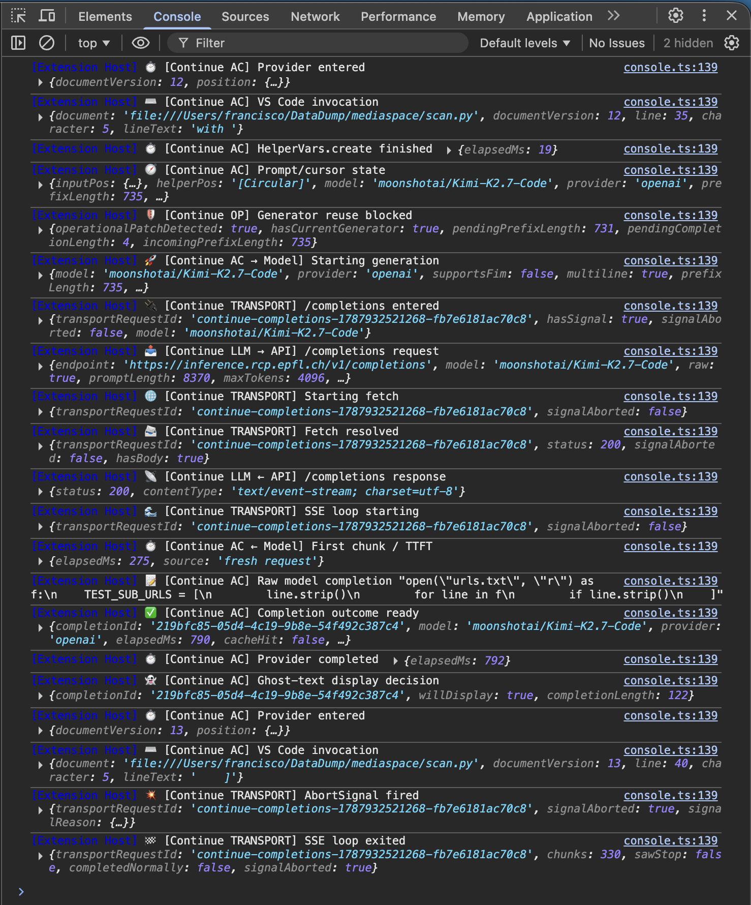
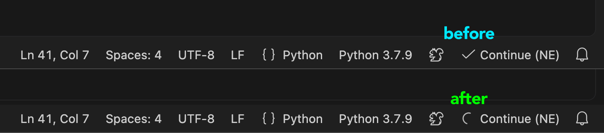

# Autocomplete for VS Code using local models

To use local or self-hosted LLMs for autocomplete in VS Code, install the `Continue` extension (by continue.dev), version **2.0.0**.

Continue provides the integration between VS Code and the LLM endpoint, but its autocomplete implementation currently has a few issues that make it difficult to use reliably with local models. In particular, unnecessarily slow requests, problematic cancellation and reuse of LLM requests, and very limited logging for understanding what happens between an autocomplete invocation and the model response.

This repo provides a small set of local patches for Continue 2.0.0 to improve autocomplete responsiveness, reliability, and observability.

The patches are split into two stages:

- `patch_logs.sh` adds detailed diagnostics for the autocomplete pipeline and LLM requests.
- `patch_code.sh` applies the behavioral fixes identified using those diagnostics, including improved request cancellation, prevention of stale generator reuse, removal of a blocking Git repository lookup, safer completion handling, and a visible `Continue` progress indicator while the LLM is generating an autocomplete response.

> ⚠ The patches modify Continue's installed `extension.js` directly and are therefore specific to the supported Continue version.

## Requirements

- VS Code
- Continue extension
- Python >= 3.11
- Node.js (optional, used to syntax-check the patched JavaScript before installation)

The current patch targets:

```text
Continue 2.0.0
```

## Installation

Clone the repository and create a Python environment:

```bash
python3 -m venv .venv
source .venv/bin/activate
pip install -e .
```

The only Python dependency currently required is PyYAML.

## Patch configuration

Patch settings are stored in:

```text
config/patch_settings.yaml
```

Example:

```yaml
supported_version: "2.0.0"

extension_path: "~/.vscode/extensions/continue.continue-2.0.0-darwin-arm64/out/extension.js"

verify_SHA256: true

expected_SHA256:
  original: a52b062dd346a4fd07da7574a3d3cd64f59a56bbd38515f53165ca41dc6a162f
  patched_logs: 82344e0a5c548da8df0f2f0cf4e858208b155c6daa426d588a38407e5201138e
  patched_full: e538270f1e68b23cd8ab92f3cbd774e20844207d988b3ad88ef8745324f413a0
```

`extension_path` must point to the installed Continue `extension.js`.

To locate it:

```bash
find ~/.vscode/extensions -path '*continue.continue-*/out/extension.js' -print
```

The scripts also verify the installed Continue version against `supported_version`.

> ⚠ Do not modify the SHA256 values.

## SHA-256 safeguard

SHA verification is enabled by default:

```yaml
verify_SHA256: true
```

This ensures that the patch is being applied to exactly the expected Continue bundle and that each generated result has the expected checksum.

The expected sequence is:

```text
original
   ↓ patch_logs.sh
patched_logs
   ↓ patch_code.sh
patched_full
```

This is the recommended mode.

To experiment with a modified bundle without enforcing the known checksums:

```yaml
verify_SHA256: false
```

The other safeguards remain active: the Python patchers still validate their expected code anchors, and `node --check` still validates the generated JavaScript when Node.js is available.

## Applying the patches

The patches must be applied in order.

First apply the logging patch:

```bash
./scripts/patch_logs.sh
```

Then apply the behavioral patch:

```bash
./scripts/patch_code.sh
```

The first patch creates a pristine backup alongside the extension:

```text
extension.js.bak
```

An existing backup is preserved rather than overwritten.

### Important: restart VS Code

After applying the patches, **completely quit VS Code and reopen it**.

On macOS:

```text
Cmd + Q
```

Simply reloading the VS Code window is not recommended because the Continue extension code may already be loaded by the extension host.

## Restoring Continue

Restore the original `extension.js` with:

```bash
./scripts/restore.sh
```

This copies the preserved `extension.js.bak` back to `extension.js` and, when SHA verification is enabled, verifies the restored checksum.

After restoring, completely quit and reopen VS Code again.

## Viewing the diagnostic logs

Open the VS Code Developer Tools:

```text
Help → Toggle Developer Tools
```

Then select the **Console** tab.

Useful filters include:

```text
Continue AC
Continue OP
Continue TRANSPORT
Continue LLM
```

The logs show information such as:

- autocomplete invocation and cancellation;
- debounce and context-building time;
- prompt/cursor information;
- LLM request start;
- time to first token (TTFT);
- raw model completion;
- HTTP/SSE transport lifecycle;
- transport cancellation;
- final ghost-text display decision.

### VS Code console



## Autocomplete progress indicator

The behavioral patch adds a spinning `Continue` status-bar indicator while an autocomplete request is actively communicating with the LLM.

This makes it much easier to distinguish between Continue waiting for the model and autocomplete being idle.

### Status-bar indicator



## Continue configuration

An example Continue configuration is provided at:

```text
config/config_continue_example.yaml
```

The local Continue configuration is normally:

```text
~/.continue/config.yaml
```

Open it with:

```bash
code ~/.continue/config.yaml
```

The supplied example currently looks roughly like:

```yaml
name: LLM Autocomplete
version: 1.0.0
schema: v1

models:
- name: Autocomplete
  provider: openai
  model: Qwen/Qwen3-VL-235B-A22B-Thinking
  apiBase: https://inference.example.com/
  apiKey: ${{ secrets.API_KEY }}

  roles:
    - autocomplete

  promptTemplates:
    autocomplete: |
      <|fim_prefix|>{{{prefix}}}<|fim_suffix|>{{{suffix}}}<|fim_middle|>

  autocompleteOptions:
    disable: false
    debounceDelay: 250
    modelTimeout: 1500
    maxPromptTokens: 8192
    maxCompletionTokens: 1024
    useCache: false
    useImports: false
    useRecentlyEdited: true
    useRecentlyOpened: false
    experimental_includeRecentlyVisitedRanges: false
    experimental_includeRecentlyEditedRanges: true
```

Adapt `model`, `apiBase`, and the FIM prompt template to the model being tested.

For example, the included configuration also contains alternative model names and a DeepSeek FIM template.

## API key

The example configuration references:

```yaml
apiKey: ${{ secrets.API_KEY }}
```

A convenient place for the secret is:

```text
~/.continue/.env
```

For example:

```bash
mkdir -p ~/.continue
```

and in `~/.continue/.env`:

```text
API_KEY=your-api-key-here
```

This is preferable to putting the key directly in `config.yaml`.

Shell environment variables can also be configured in files such as `.zshrc`, `.bashrc`, or `.bash_profile`, but GUI applications on macOS do not necessarily inherit your interactive shell environment. For VS Code/Continue, `~/.continue/.env` avoids that ambiguity.

Never commit API keys to this repository.

## Experimenting with models

When testing autocomplete models, change one thing at a time and use the diagnostic console to compare results.

The most useful parameters to experiment with are:

```yaml
debounceDelay: 250
modelTimeout: 1500
maxPromptTokens: 8192
maxCompletionTokens: 1024
```

In particular:

- `debounceDelay` controls how quickly a request starts after typing;
- `modelTimeout` determines how long Continue waits for autocomplete;
- `maxPromptTokens` controls the amount of context;
- `maxCompletionTokens` limits generated autocomplete length.

For inline autocomplete, smaller completion limits such as `256` or `512` are also worth testing.

Pay attention to the logged **TTFT** rather than only overall completion quality: a model can be excellent for chat but too slow for interactive autocomplete.

Also make sure the model uses the correct Fill-In-the-Middle (FIM) template. Qwen/Kimi and DeepSeek-style models may require different FIM tokens.

## After a Continue update

A Continue update will normally replace the installed extension and may change its bundled JavaScript.

Do **not** simply change `supported_version` and disable the safeguards.

The patch should first be checked against the new `extension.js`, since the code locations modified by the patch may have changed. The expected SHA-256 values must also be regenerated for the new build.

## Troubleshooting

If the script reports:

```text
Unsupported Continue version
```

check the installed version and `supported_version`.

If it reports:

```text
Target not found
```

locate Continue with:

```bash
find ~/.vscode/extensions -path '*continue.continue-*/out/extension.js' -print
```

If a SHA checksum fails, do not immediately replace the expected checksum. First determine why the installed bundle differs.

If a Python patch reports that an expected anchor was not found exactly once, the Continue implementation probably differs from the version for which the patch was written.

To return to a known state:

```bash
./scripts/restore.sh
./scripts/patch_logs.sh
./scripts/patch_code.sh
```

Then completely quit and reopen VS Code.
