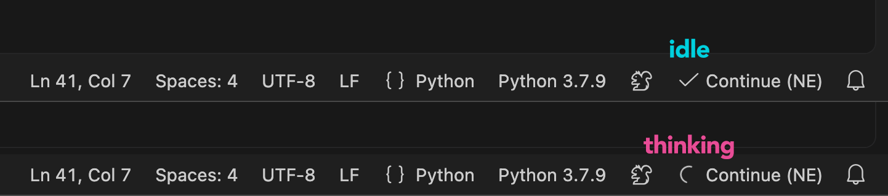

# Autocomplete for VS Code using local models

This project provides configuration examples and optional patches for using local or self-hosted LLMs for autocomplete in VS Code with the `Continue` extension (by continue.dev).

The recommended approach is:

1. **Configure Continue first.** A good `config.yaml` is often sufficient for fast and reliable autocomplete.
2. **Add diagnostic logging if needed.** An optional logging patch makes it possible to inspect the autocomplete pipeline and LLM requests in detail.
3. **Apply behavioral fixes only if needed.** A second, more experimental patch addresses several issues observed while testing Continue 2.0.0.

The patches are not required to use local models with Continue.

## 1. Configure Continue

Install the Continue extension in VS Code and create or edit the local configuration:

```text
~/.continue/config.yaml
```

Open it with:

```bash
code ~/.continue/config.yaml
```

An example configuration is provided at:

```text
config/config_continue_example.yaml
```

It currently looks roughly like:

```yaml
name: LLM Autocomplete
version: 1.0.0
schema: v1

models:
- name: Autocomplete
  provider: openai
  model: Qwen/Qwen3-VL-235B-A22B-Thinking
  apiBase: https://inference.example.com/
  apiKey: ${{ secrets.API_KEY }}

  roles:
    - autocomplete

  promptTemplates:
    autocomplete: |
      <|fim_prefix|>{{{prefix}}}<|fim_suffix|>{{{suffix}}}<|fim_middle|>

  autocompleteOptions:
    disable: false
    debounceDelay: 250
    modelTimeout: 1500
    maxPromptTokens: 8192
    maxCompletionTokens: 1024
    useCache: false
    useImports: false
    useRecentlyEdited: true
    useRecentlyOpened: false
    experimental_includeRecentlyVisitedRanges: false
    experimental_includeRecentlyEditedRanges: true
```

Adapt `model`, `apiBase`, and the FIM prompt template to the model being tested.

The included example also contains alternative model names and a DeepSeek FIM template.

### API key

The example configuration references:

```yaml
apiKey: ${{ secrets.API_KEY }}
```

Store the secret in:

```text
~/.continue/.env
```

Create the directory if necessary:

```bash
mkdir -p ~/.continue
```

and add:

```text
API_KEY=your-api-key-here
```

Using `~/.continue/.env` is preferable to putting the key directly in `config.yaml`.

It is also preferable to relying on `.zshrc`, `.bashrc`, or `.bash_profile`: GUI applications on macOS do not necessarily inherit the environment of an interactive shell, whereas Continue can resolve the secret directly from its `.env` file.

Never commit API keys to this repository.

### Experimenting with models

When testing autocomplete models, change one thing at a time and compare both latency and completion quality.

Useful parameters to experiment with include:

```yaml
debounceDelay: 250
modelTimeout: 1500
maxPromptTokens: 8192
maxCompletionTokens: 1024
```

In particular:

- `debounceDelay` controls how quickly a request starts after typing;
- `modelTimeout` determines how long Continue waits for autocomplete;
- `maxPromptTokens` controls the amount of context;
- `maxCompletionTokens` limits generated autocomplete length.

For inline autocomplete, smaller completion limits such as `256` or `512` are also worth testing.

The context options can also have an important effect on autocomplete behavior and startup overhead:

```yaml
useCache: false
useImports: false
useRecentlyEdited: true
useRecentlyOpened: false
experimental_includeRecentlyVisitedRanges: false
experimental_includeRecentlyEditedRanges: true
```

Also make sure the model uses the correct Fill-In-the-Middle (FIM) template. Qwen/Kimi and DeepSeek-style models may require different FIM tokens.

If autocomplete works well at this point, **no patch is necessary**.

## 2. Add diagnostic logging [optional]

If autocomplete is slow, gets cancelled unexpectedly, produces stale results, or otherwise behaves unexpectedly, an optional patch adds detailed diagnostics to Continue's autocomplete pipeline.

The logging patch does not attempt to change autocomplete behavior. Its purpose is to make it easier to determine where time is being spent and what happens between the VS Code autocomplete invocation and the LLM response.

> ⚠ The patch modifies Continue's installed `extension.js` directly and is specific to the supported Continue version.

### Requirements

- VS Code
- Continue extension
- Python >= 3.11
- Node.js *(optional; if available, the generated JavaScript is syntax-checked before installation)*

The current patch targets:

```text
Continue 2.0.0
```

### Installation

Clone this repository and create a Python environment:

```bash
python3 -m venv .venv
source .venv/bin/activate
pip install -e .
```

The only Python dependency currently required is PyYAML.

### Patch configuration

Patch settings are stored in:

```text
config/patch_settings.yaml
```

Example:

```yaml
supported_version: "2.0.0"

extension_path: "~/.vscode/extensions/continue.continue-2.0.0-darwin-arm64/out/extension.js"

verify_SHA256: true

expected_SHA256:
  original: a52b062dd346a4fd07da7574a3d3cd64f59a56bbd38515f53165ca41dc6a162f
  patched_logs: 82344e0a5c548da8df0f2f0cf4e858208b155c6daa426d588a38407e5201138e
  patched_full: e538270f1e68b23cd8ab92f3cbd774e20844207d988b3ad88ef8745324f413a0
```

`extension_path` must point to the installed Continue `extension.js`.

To locate it:

```bash
find ~/.vscode/extensions -path '*continue.continue-*/out/extension.js' -print
```

The scripts also verify the installed Continue version against `supported_version`.

> ⚠ Do not modify the SHA-256 values merely to make a failed verification pass.

### SHA-256 safeguard

SHA verification is enabled by default:

```yaml
verify_SHA256: true
```

This verifies both the input Continue bundle and the generated patched bundle.

The expected sequence is:

```text
original
   ↓ patch_logs.sh
patched_logs
   ↓ patch_code.sh
patched_full
```

To experiment with a modified bundle without enforcing the known checksums:

```yaml
verify_SHA256: false
```

The other safeguards remain active: the Python patchers still validate their expected code anchors, and `node --check` validates the generated JavaScript when Node.js is available.

### Apply the logging patch

Run:

```bash
./scripts/patch_logs.sh
```

The script creates a pristine backup alongside the extension:

```text
extension.js.bak
```

An existing backup is preserved rather than overwritten.

After patching, **completely quit VS Code and reopen it**.

On macOS:

```text
Cmd + Q
```

### Viewing the diagnostic logs

Open the VS Code Developer Tools:

```text
Help → Toggle Developer Tools
```

Then select the **Console** tab.

Useful filters include:

```text
Continue AC
Continue OP
Continue TRANSPORT
Continue LLM
```

The logs expose information such as:

- autocomplete invocation and cancellation;
- debounce and context-building time;
- prompt/cursor information;
- LLM request start;
- time to first token (TTFT);
- raw model completion;
- HTTP/SSE transport lifecycle;
- transport cancellation;
- final ghost-text display decision.

This makes it possible to distinguish, for example, between time spent preparing an autocomplete request and time actually spent waiting for the LLM.

### VS Code console


## 3. Apply behavioral improvements [optional]

A second patch contains behavioral changes developed while investigating autocomplete with local models.

This patch is **not required** and should preferably be applied only when the corresponding behavior is useful or when the problems it addresses can be reproduced.

It currently includes changes related to:

- cancellation of obsolete LLM requests;
- prevention of stale generator reuse;
- stale autocomplete invocation handling;
- defensive completion handling;
- removal of a potentially blocking Git repository lookup from the autocomplete path;
- improved tracking of the native Continue autocomplete progress indicator.

Because these changes modify Continue's behavior rather than merely adding diagnostics, they should be considered more experimental than the logging patch.

The behavioral patch expects the logging patch to have been applied first:

```bash
./scripts/patch_code.sh
```

The resulting sequence is therefore:

```text
vanilla Continue
       │
       ├── works well → stop here
       │
       ↓
patch_logs.sh          [optional diagnostics]
       │
       ├── diagnostics sufficient → stop here
       │
       ↓
patch_code.sh          [optional behavioral changes]
```

After applying the behavioral patch, completely quit and reopen VS Code.

### Autocomplete progress indicator

Continue already provides a spinning status-bar indicator while autocomplete is communicating with the LLM.

The behavioral patch improves this indicator by correctly tracking overlapping and cancelled requests, so the spinner remains active until all in-flight autocomplete requests have finished.



## Restoring Continue

Restore the original `extension.js` with:

```bash
./scripts/restore.sh
```

This copies the preserved `extension.js.bak` back to `extension.js` and, when SHA verification is enabled, verifies the restored checksum.

After restoring, completely quit and reopen VS Code again.

## After a Continue update

A Continue update will normally replace the installed extension and may change its bundled JavaScript.

Do **not** simply change `supported_version` or disable the safeguards.

The patches should first be checked against the new `extension.js`, since the code locations they modify may have changed. The expected SHA-256 values must also be regenerated for the new build.

A new Continue version may also fix some or all of the behaviors addressed here, so the patches should be reevaluated rather than automatically ported.

## Troubleshooting

If the script reports:

```text
Unsupported Continue version
```

check the installed version and `supported_version`.

If it reports:

```text
Target not found
```

locate Continue with:

```bash
find ~/.vscode/extensions -path '*continue.continue-*/out/extension.js' -print
```

If a SHA checksum fails, do not immediately replace the expected checksum. First determine why the installed bundle differs.

If a Python patch reports that an expected anchor was not found exactly once, the Continue implementation probably differs from the version for which the patch was written.

To return to the pristine Continue bundle:

```bash
./scripts/restore.sh
```

From there, apply only the patch stages you actually need:

```bash
./scripts/patch_logs.sh
```

and, if desired:

```bash
./scripts/patch_code.sh
```

Then completely quit and reopen VS Code.
